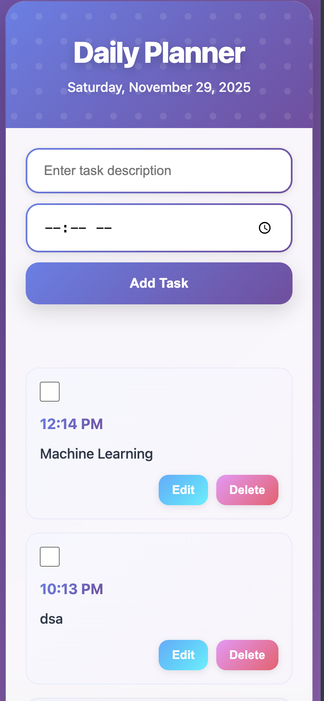

# Daily Planner

A beautiful, modern web-based daily planner application built with vanilla HTML, CSS, and JavaScript. Features an advanced UI with animations, glassmorphism effects, and persistent local storage.

## Features

- ✨ **Advanced UI** - Animated gradients, glassmorphism, and smooth transitions
- 📝 **Task Management** - Add, edit, delete, and complete tasks
- ⏰ **Time Slots** - Assign optional time slots to tasks
- 💾 **Persistent Storage** - Tasks saved automatically to browser local storage
- 📱 **Responsive Design** - Works seamlessly on desktop and mobile
- 🎨 **Modern Animations** - Smooth fade-ins, slides, and hover effects
- ♿ **Accessible** - Keyboard navigation and ARIA labels

## Demo

Open `index.html` in your browser to see it in action!

## Screenshots



## Installation

1. Clone the repository:
```bash
git clone https://github.com/YOUR_USERNAME/daily-planner.git
cd daily-planner
```

2. Open `index.html` in your browser:
```bash
open index.html
# or
start index.html
# or simply double-click the file
```

That's it! No build process or dependencies required.

## Usage

### Adding Tasks
1. Enter a task description in the input field
2. Optionally select a time slot
3. Click "Add Task" or press Enter

### Managing Tasks
- **Complete**: Click the checkbox to mark tasks as complete
- **Edit**: Click the "Edit" button to modify task details
- **Delete**: Click the "Delete" button to remove tasks

### Data Persistence
All tasks are automatically saved to your browser's local storage and will persist between sessions.

## Project Structure

```
daily-planner/
├── index.html              # Main HTML file
├── styles.css              # Advanced CSS with animations
├── app.js                  # Main application controller
├── js/
│   ├── taskManager.js      # Task CRUD operations
│   ├── storageManager.js   # Local storage interface
│   ├── uiManager.js        # DOM manipulation
│   └── dateManager.js      # Date formatting and updates
└── README.md
```

## Technologies Used

- **HTML5** - Semantic markup
- **CSS3** - Advanced animations, gradients, and glassmorphism
- **JavaScript (ES6+)** - Modular architecture with ES6 modules
- **Local Storage API** - Data persistence

## Browser Compatibility

Works on all modern browsers:
- Chrome/Edge (latest)
- Firefox (latest)
- Safari (latest)

## Contributing

Contributions are welcome! Feel free to open issues or submit pull requests.

## License

MIT License - feel free to use this project for personal or commercial purposes.

## Author

Your Name - [Lakshay_Singh](https://github.com/MrStark65)

## Acknowledgments

- Design inspired by modern UI/UX trends
- Built as a demonstration of vanilla JavaScript capabilities
